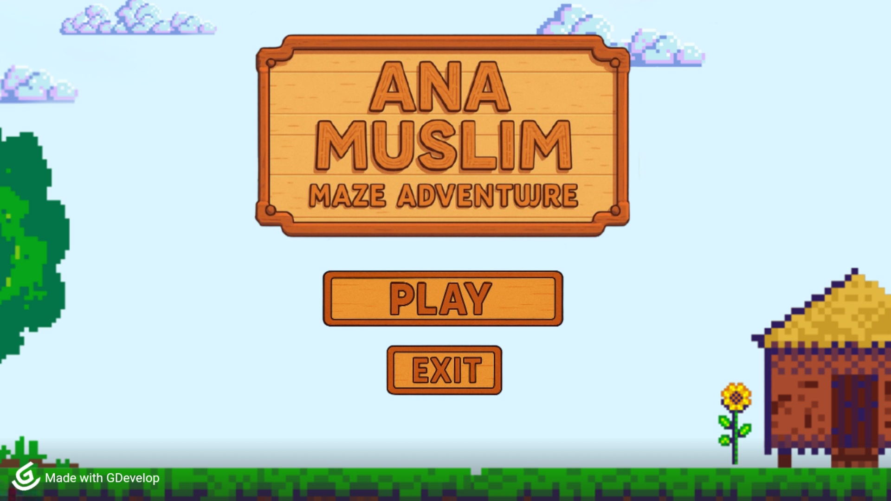
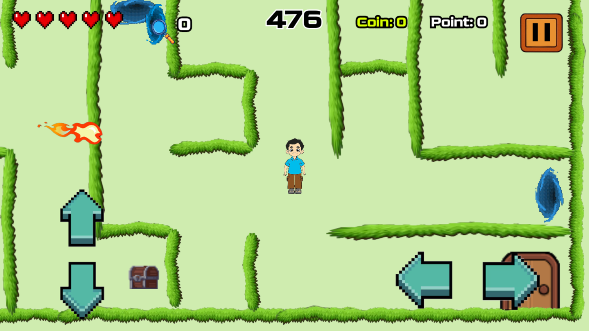
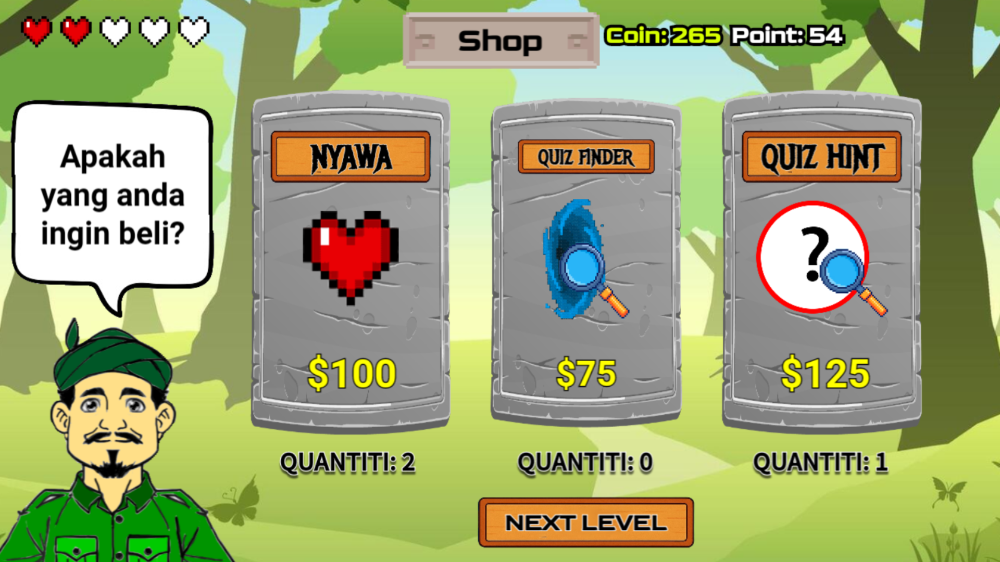
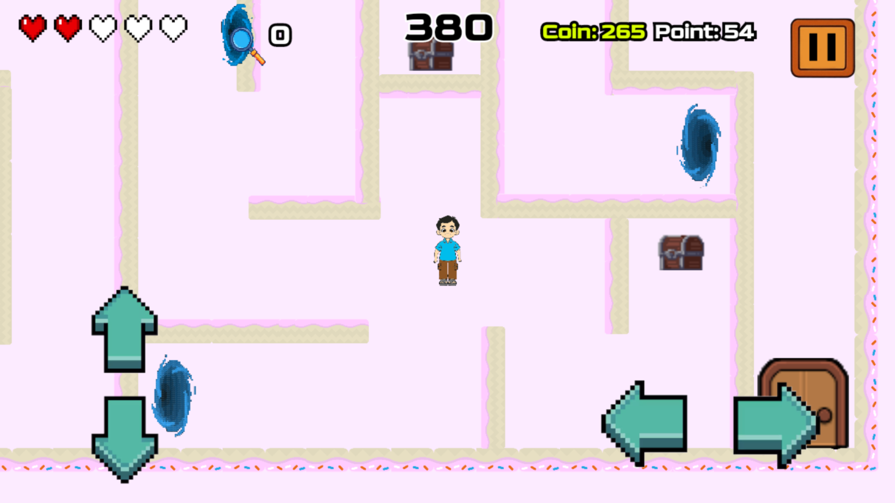

# Ana Muslim Maze Adventure

Ana Muslim Maze Adventure is a 2D maze-based educational adventure game created using GDevelop 5. Players explore themed mazes, discover hidden quiz portals, solve educational puzzles, collect rewards, and progress through increasingly challenging levels inspired by Islamic values and learning.

---

## Gameplay Preview

<p align="center">
  
  
</p>

<p align="center">
  
  
</p>

---

## Features

* 2D maze exploration gameplay
* Educational quiz system
* Islamic-themed learning experience
* Multiple themed maze levels
* Hidden quiz portals
* Reward chest system
* Health and life system
* Coin and point collection
* Shop system with bonus items
* Increasing difficulty progression

---

## Game Levels

### Level 1 — Forest Maze

* Grass-themed maze
* 6 Quiz Portals
* 3 hidden chests
* Beginner-friendly level design

### Level 2 — Candy Maze

* Candy-themed environment
* 6 Quiz Portals
* 4 hidden chests
* More complex pathways

### Level 3 — Ice Maze

* Winter and ice-themed maze
* 7 Quiz Portals
* 6 hidden chests
* Advanced maze difficulty

---

## Gameplay Mechanics

### Exploration

Players must navigate through maze paths to locate hidden Quiz Portals and treasure chests.

### Quiz System

Entering a Quiz Portal teleports the player to a quiz level where they must solve word puzzles and answer educational questions.

### Life System

Players begin with 5 lives. Incorrect quiz answers reduce one life.

### Shop System

Coins collected throughout the game can be used to purchase:

* Extra Health
* Quiz Hints
* Quiz Finder

---

## Controls

| Key                     | Action                |
| ----------------------- | --------------------- |
| Arrow Keys / WASD       | Move Character        |
| Enter / Interaction Key | Interact with objects |

---

## Characters

### Ali

A curious and determined young boy who explores the maze and solves educational challenges.

### Aina

A bright and adventurous girl who joins the journey with wisdom, courage, and faith.

### Ahmad & Natasya

Supportive parental characters who guide and encourage players throughout the adventure.

---

## Built With

* GDevelop 5
* Event-Based Game Logic
* 2D Sprite Animation
* Maze and Puzzle Design

---

## How To Play

1. Download or clone the repository.
2. Open the project using GDevelop 5.
3. Launch the preview or export the game.
4. Explore the maze and complete all quizzes to progress.

---

## Project Structure

```text
Ana-Muslim-Maze-Adventure/
├── assets/
├── screenshots/
├── scenes/
├── README.md
```

---

## Release

Download the latest playable version from the [Releases](../../releases/latest) page.

---

## Authors

* Lai Yong Kang
* Roisrobbie Robert Anak Robbin
* Muhamad Zamwani Bin Zairul Azmin
* Ngang Ze Ming

---

## License

This project was created for educational purposes.
